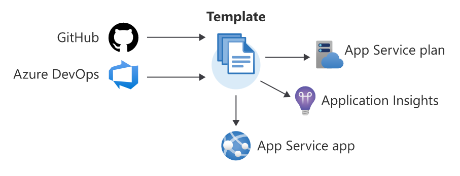

## 1. Introduction to infrastructure as code using Bicep
Infrastructure as code, sometimes referred to as IaC, is the process of provisioning infrastructure resources similar to how software is deployed.



### 1.1 Benefits of infrastructure as code
- Increase confidence in deployments
    - **integration with current processes**: peer reviews on infrastructure configuration changes
    - **consistency**: helps teams to follow well-established processes to deploy infrastructure, reduce human error
    - **automated scanning**: automated scanning of the infrastructure configuration to ensure that security and performance practices are followed
    - **secret management**: integrate with secret stores (eg: Key Vault) to access secrets securely at deployment
    - **access control**: ability to use managed identities or service accounts, prevent unauthorized configuration changes, if necessary, this process can be overriden using an emergency access account (break glass account)
    - **avoid configuration drift**: idempotence, provide the same result each deployment
- Manage multiple environments
    - **provision new environments**: scale to multiple instances of the application
    - **non-production environments**: use the same configuration files for each environment, but supply different input parameters to create uniqueness
    - **disaster recovery**: recreate environemnt in another region because of a service outage, provision new instance to fail over instead of manually deploying and reconfiguring everything
- Better understand cloud resources
    - **audit trail**: changes to the infrastructure as code configurations are version-controlled in the same way as application source code
    - **documentation**: add metadata (like comments) to the infrastructure as code configurations which describes the purpose of the code in your configurations
    - **unified system**: using a common system for application and infrastructure code, it is easier to understand the relationship between applications and the infrastructure
    - **better understanding of cloud infrastructure**: when using graphical user interfaces (eg: Azure Portal) to provision resources, many of the processes are abstracted from view, infrastructure as code can help provide a better understanding of how Azure works and how to troubleshoot issues that might arise

### 1.2 Difference between declarative and imperative infrastructure as code
- **Imperative code**: execute a sequence of commands, in a specific order, to reach an end configuration.
    - defines what the code should accomplish
    - defines how to accomplish the task
    - "step-by-step instruction manual"
    - accomplished programmatically by using a scripting language (Bash, Azure PowerShell)
    - Azure CLI example:
        ```bash
        #!/usr/bin/env bash
        az group create \
            --name storage-resource-group \
            --location eastus

        az storage account create \
            --name mystorageaccount \
            --resource-group storage-resource-group \
            --kind StorageV2 \
            --access-tier Hot \
            --https-only true
        ```
    - disadvantages:
        - scripts can become complex to manage in a growing architecture
        - commands may be updated or deprecated, which requires modifications to existing scripts
- **Declarative code**
    - declarative approach is like the "exploded-view drawing" of an instruction manual, showing the different components and the relationship between them
    - accomplished by using **templates**, many types are available:
        - JSON
        - Azure Bicep
        - Ansible (by RedHat)
        - Terraform (by HashiCorp)
    - Azure Bicep template example:
        ```bicep
        resource storageAccount 'Microsoft.Storage/storageAccounts@2019-06-01' = {
            name: 'mystorageaccount'
            location: 'eastus'
            sku: {
                name: 'Standard_LRS'
            }
            kind: 'StorageV2'
            properties: {
                accessTier: 'hot'
                supportsHttpsTrafficOnly: true
            }
        }
        ```
    - disadvantages:
        - the template doesn't define how to accomplish the task, the actual steps are executed behind the scenes


### 1.3 What is Bicep? How does it fits into an infrastructure as code approach?
- Bicep is a Resource Manager template language that's used to declaratively deploy Azure resources. 
    - it is a **domain specific language** (DSL) designed for a specific domain and not meant to be used as a standard programming language
        - only used to create Resource Manager templates
    - the syntax is intended to be easy to understand and straightforward to learn
        - simplifies the template creation experience over JSON templates, creating JSON ARM templates requires complicated expressions
    - better support for modularity, reusable code and type safety
- Benefits
    - **simpler syntax**
        - reference parameters and variables directly without using complicated functions
        - string interpolation is used
        - reference properties of a resource directly by using its symbolic name
    - **modules**: break down complex template deployments into smaller module files and reference them in a main template to provide easier management and greater reusability
    - **automatic dependency management**: Bicep automatically detects dependencies between resources
    - **type validation and IntelliSense**: the Bicep extension for VSCode features rich validation and IntelliSense for all Azure resource type API definitions
- Example Bicep template: Azure storage account
    - name of the account is automatically generated by the template using `uniqueString()`
    - the resource ID is returned as output to the user who executes the template
    ```bicep
    param location string = resourceGroup().location
    param namePrefix string = 'storage'

    var storageAccountName = '${namePrefix}${uniqueString(resourceGroup().id)}'
    var storageAccountSku = 'Standard_RAGRS'

    resource storageAccount 'Microsoft.Storage/storageAccounts@2019-06-01' = {
        name: storageAccountName
        location: location
        kind: 'StorageV2'
        sku: {
            name: storageAccountSku
        }
        properties: {
            accessTier: 'Hot'
            supportsHttpsTrafficOnly: true
        }
    }

    output storageAccountId string = storageAccount.id
    ```
- How Bicep works: transpilation of Bicep template to JSON template
    
    - Deploy the Bicep template to the resource group named 'storage-resource-group':
        - `az deployment group create --template-file ./main.bicep --resource-group storage-resource-group`
    - View the JSON template that is submitted to the Resource Manager:
        - `bicep build ./main.bicep`
- JSON vs. Bicep templates: [Bicep Playground](https://bicepdemo.z22.web.core.windows.net/)
- When to use Bicep
    - **Azure-native**: Bicep supports all Azure features on day one of newly released or updated resource types
    - **Azure integration**: ARM templates (both JSON and Bicep) are fully integrated within the Azure platform, with Resource Manager-based deployments, you can monitor the progress of your deployments in the Azure portal
    - **Azure support**: fully supported product with Microsoft Support
    - **No state management**: Bicep deployments compare the current state of your Azure resources with the state that you define in the template, you don't need to keep your resource state information somewhere else, like in a storage account, Azure automatically keeps track of this state for you
    - **Easy transition from JSON**: not a difficult process to transition to using Bicep when already using a declarative template language, you can use Bicep CLI to decompile any ARM template into a Bicep template
        - `bicep decompile`
- When not to use Bicep
    - **Existing tool set**: sometimes it makes sense to use existing financial/knowledge investments when you consider adopting a new process
    - **Multi-cloud**: other Cloud providers don't support Bicep as a template language, open-source tools like Terraform can be used for multi-cloud deployments
